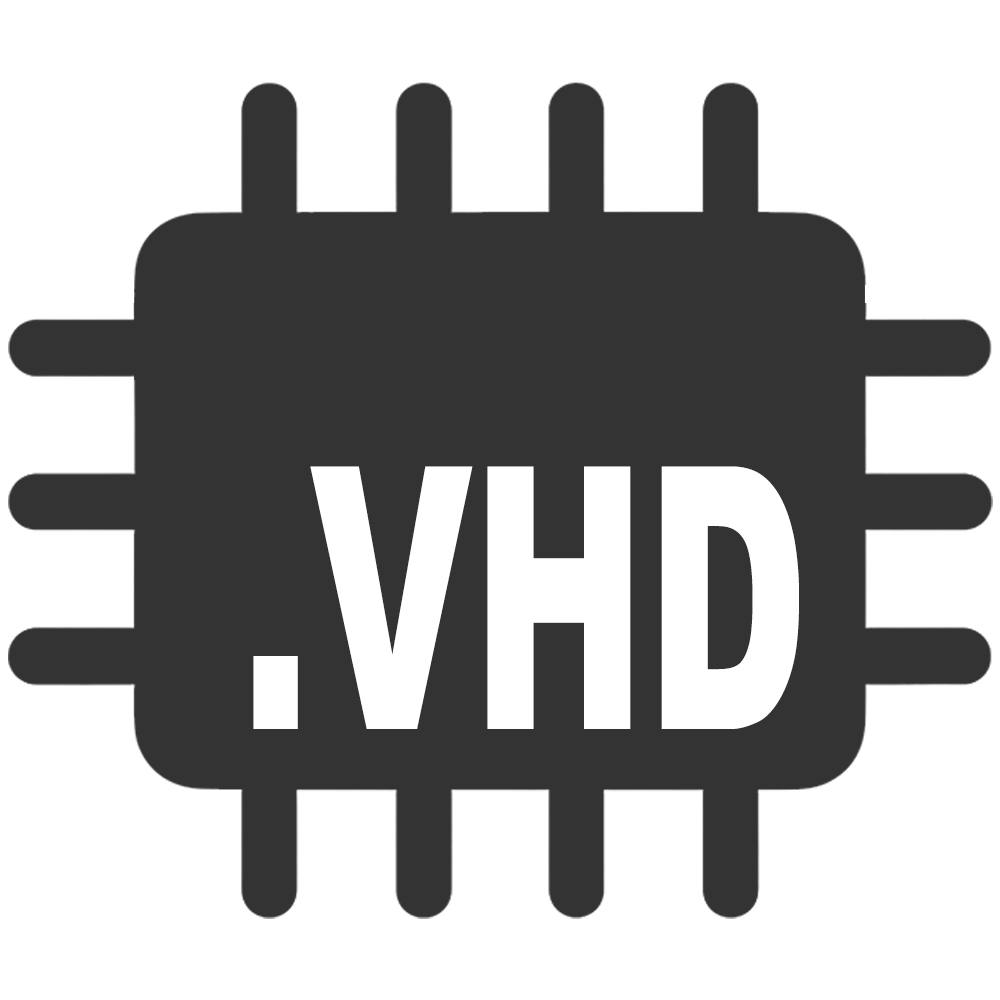
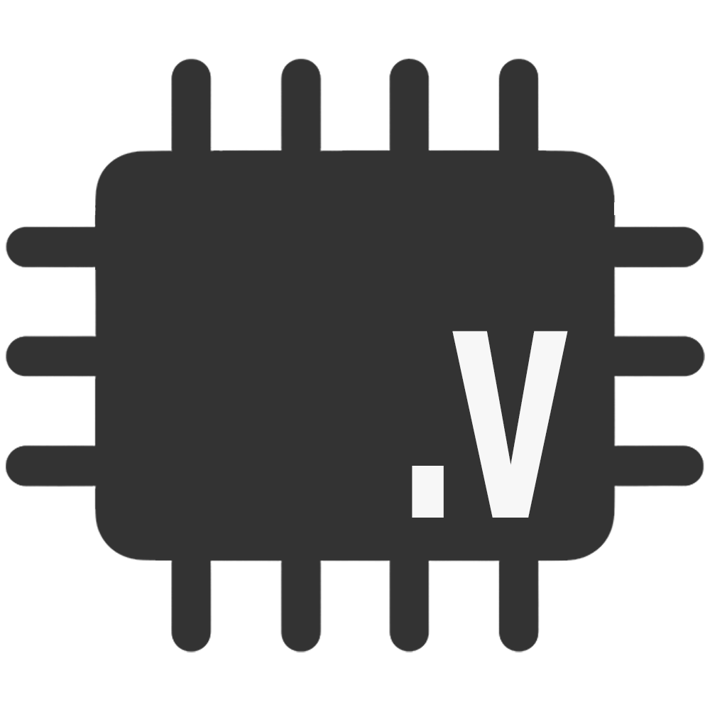
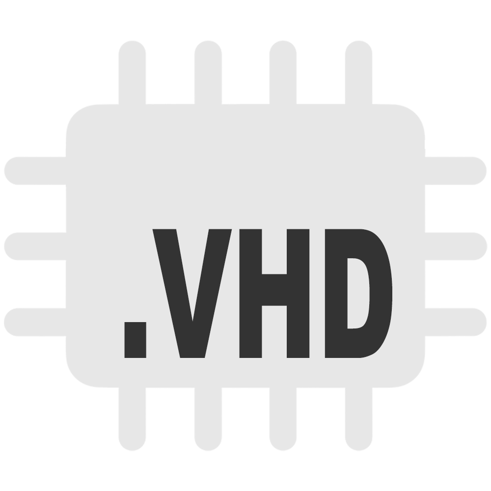
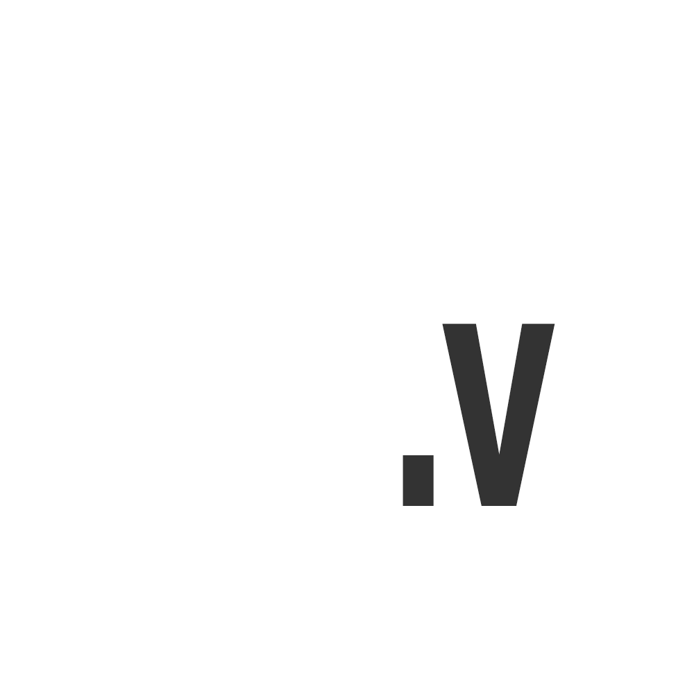

## VHDL, Verilog & SystemVerilog Logos

### Color Logos
**SystemVerilog Logo**  
  

**Verilog Logo**  
  

**VHDL Logo**  
  

**VHDL Logo**  
  

**SystemVerilog Logo**  
  

**Verilog Logo**  
  

### Grayscale Logos Set 1

**VHDL Logo B/W 1**  
  

**SystemVerilog Logo B/W 1**  
  

**Verilog Logo B/W 1**  
  

### Grayscale Logos Set 2

**VHDL Logo B/W 2**  
  

**SystemVerilog Logo B/W 2**  
  

**Verilog Logo B/W 2**  
  
